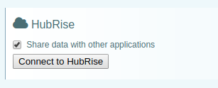

- Open the LivePepper back-office https://manager.livepepper.com/

- Navigate to `Settings` / `Add-ons`

- In the `HubRise` section, tick the checkbox:
 

- A`Connect to HubRise` button shows up:

- Click on the button and follow instructions